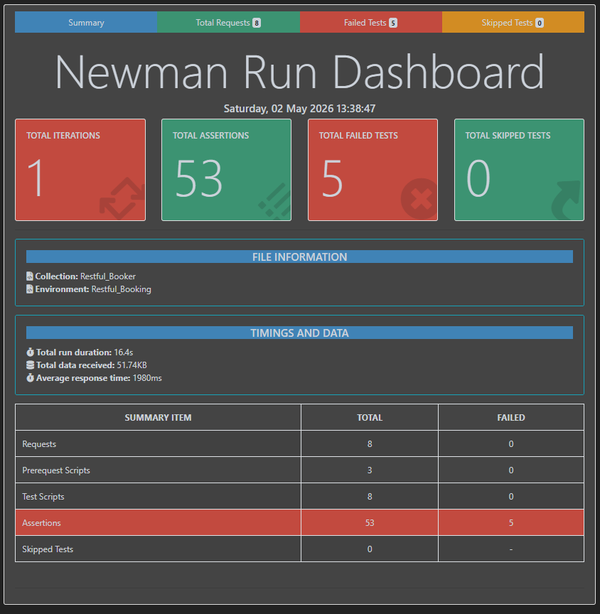
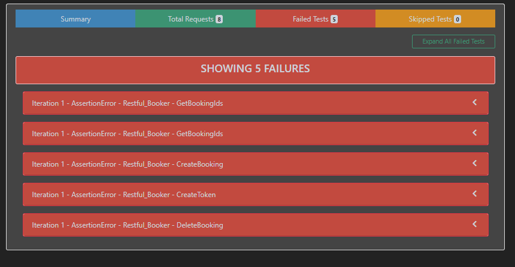
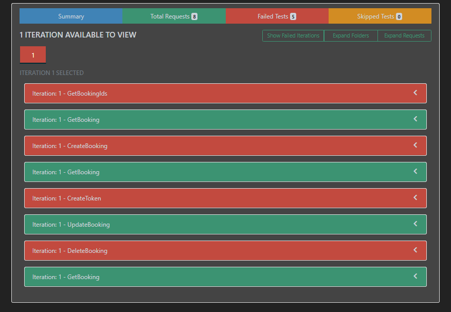

## 📌 Description:
This repository contains automated API tests for the **Restful Booker API** using **Postman** and **Newman**. The project validates multiple API endpoints including booking creation, authentication, retrieval, and deletion.

The test suite ensures correctness of API behavior by validating **status codes**, **response time**, **response size**, and **data integrity**. Newman is used to execute the tests via command line and generate detailed **HTML reports** for analysis.

---

## 🚀 Features:

- Automated API testing using **Postman**
- CLI-based execution using **Newman**
- Covers core endpoints:
  - Booking retrieval
  - Booking creation
  - Authentication (token generation)
  - Booking deletion
- Assertions include:
  - HTTP status codes
  - Response time validation
  - Response size validation
  - Data correctness
- Generates detailed **HTML reports**

---

# 📊 Summary of the Project:
# 🧪 Restful Booker API Testing with Postman + Newman

📦 This project automates **API testing** for the **Restful Booker API** using **Postman** and **Newman**. It validates API reliability, performance, and correctness through structured test cases and generates **HTML reports** for clear visualization of results.

---

## 🔧 Features

- 📬 Automated API Testing using **Postman**
- 💻 Command-line execution with **Newman**
- 📊 HTML report generation after test execution
- ✅ Assertions for:
  - Response content
  - Status codes
  - Performance (response time)
  - Response size validation

---

## 📸 Test Report Screenshots





---

## 📁 Folder Structure

```plaintext
Restful_Booker_API_Testing/
│
├── Restful_Booker.postman_collection.json     # Main Postman collection
├── Restful_Booking.postman_environment.json   # Environment variables
├── report.html                                # Newman HTML report
├── assets/                                    # Screenshots for README
└── README.md                                  # Documentation
